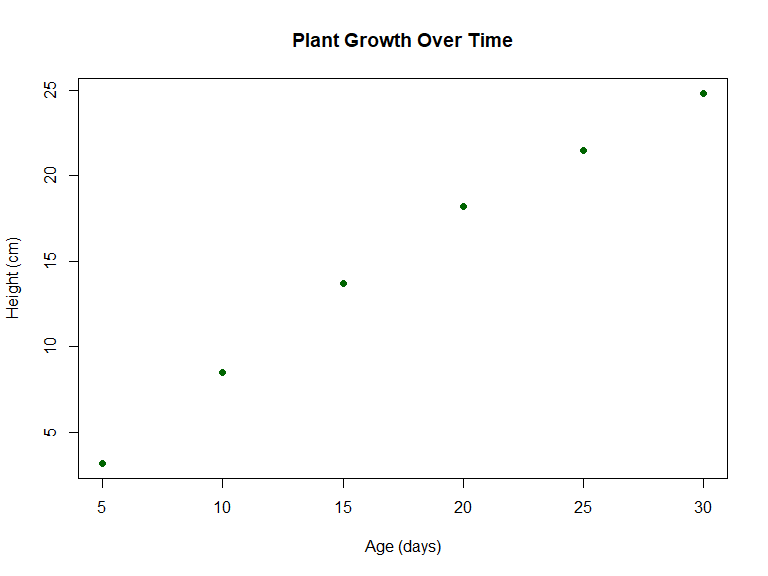
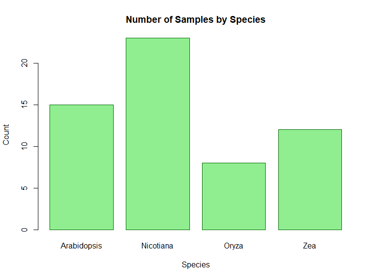
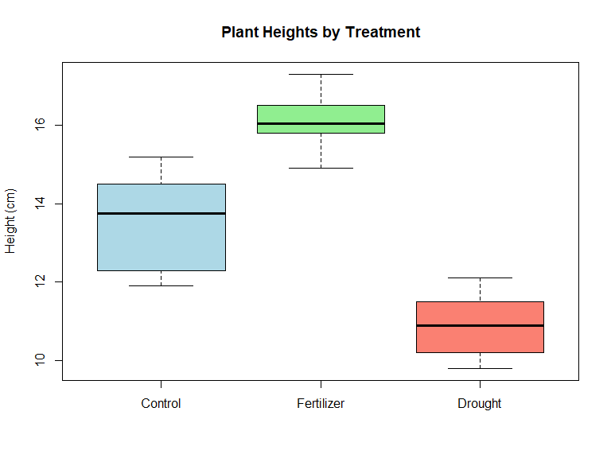
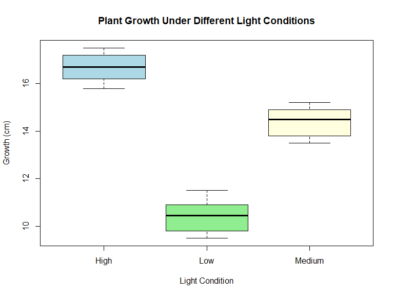
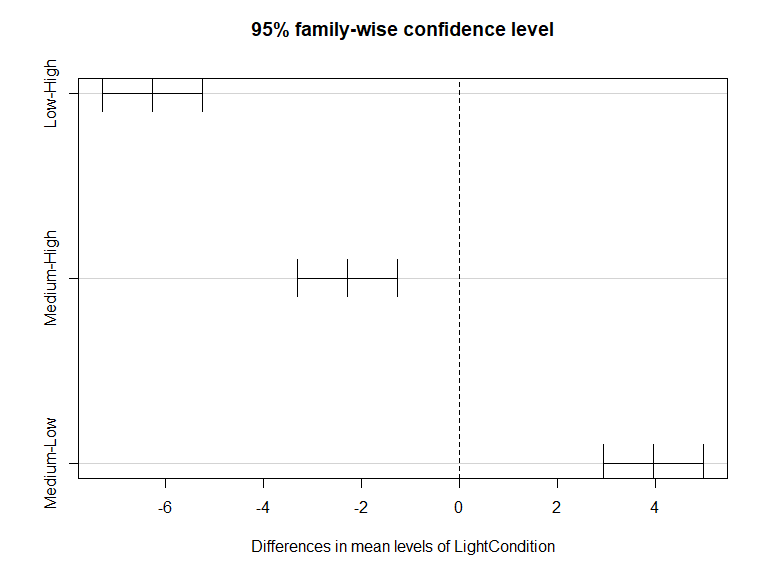
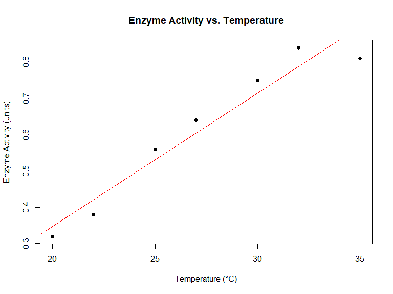
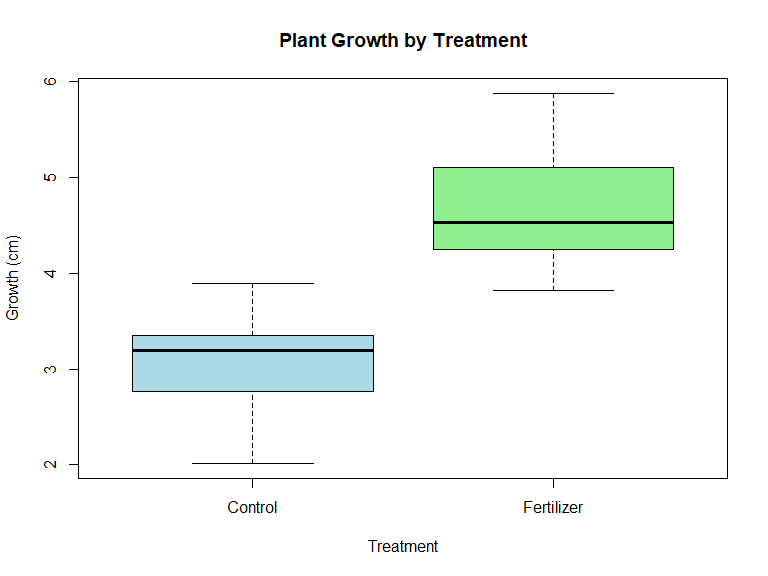

Introduction to R for Biology Students
================
Todsapol Techo and Claude (AI)
April 29, 2025

- [Welcome to R!](#welcome-to-r)
  - [What is R and Why Should Biology Students Learn
    It?](#what-is-r-and-why-should-biology-students-learn-it)
  - [What is R Markdown?](#what-is-r-markdown)
- [Getting Started with R](#getting-started-with-r)
  - [Basic Operations](#basic-operations)
  - [Variables](#variables)
  - [Data Types](#data-types)
  - [Vectors](#vectors)
  - [Factors](#factors)
- [Data Structures](#data-structures)
  - [Data Frames](#data-frames)
  - [Lists](#lists)
- [Basic Plotting](#basic-plotting)
  - [Scatter Plots](#scatter-plots)
  - [Bar Plots](#bar-plots)
  - [Box Plots](#box-plots)
- [Basic Statistics](#basic-statistics)
  - [Descriptive Statistics](#descriptive-statistics)
  - [T-Test](#t-test)
  - [Analysis of Variance (ANOVA)](#analysis-of-variance-anova)
    - [Understanding ANOVA Results:](#understanding-anova-results)
  - [Correlation](#correlation)
- [Working with Biological Data](#working-with-biological-data)
  - [Reading Data from Files](#reading-data-from-files)
  - [Example: Plant Growth Analysis](#example-plant-growth-analysis)
- [Installing and Loading Packages](#installing-and-loading-packages)
  - [Example: Enhanced Plotting with
    ggplot2](#example-enhanced-plotting-with-ggplot2)
- [Practice Exercises](#practice-exercises)
- [Additional Resources](#additional-resources)
- [Next Steps](#next-steps)

# Welcome to R!

## What is R and Why Should Biology Students Learn It?

R is a free, open-source programming language and software environment
designed specifically for statistical computing and graphics. For
biology students, R offers powerful tools to:

- Analyze experimental data
- Create publication-quality visualizations
- Conduct statistical tests common in biological research
- Work with large biological datasets (genomics, proteomics, etc.)
- Automate repetitive tasks in your research workflow

This R Markdown document will guide you through the basics of R with
examples relevant to biology.

## What is R Markdown?

This document is created in R Markdown, which allows you to: - Write
explanatory text (like what you’re reading now) - Include R code chunks
that can be executed - Show both code and its output (text, tables, or
figures) - Export to various formats (HTML, PDF, Word)

R Markdown is ideal for reproducible research and lab reports!

# Getting Started with R

## Basic Operations

Let’s start with simple arithmetic operations:

``` r
# Addition
5 + 3
```

    ## [1] 8

``` r
# Subtraction
10 - 4
```

    ## [1] 6

``` r
# Multiplication
6 * 7
```

    ## [1] 42

``` r
# Division
15 / 3
```

    ## [1] 5

``` r
# Exponentiation
2^3
```

    ## [1] 8

``` r
# Integer division
17 %/% 5
```

    ## [1] 3

``` r
# Modulo (remainder)
17 %% 5
```

    ## [1] 2

## Variables

In R, we can store values in variables:

``` r
# Assign a value to a variable
plant_height <- 10.5
leaf_count <- 25

# Print the values
plant_height
```

    ## [1] 10.5

``` r
leaf_count
```

    ## [1] 25

``` r
# We can perform operations with variables
total_height <- plant_height * 2
total_height
```

    ## [1] 21

``` r
# We can update variables
plant_height <- plant_height + 2
plant_height
```

    ## [1] 12.5

## Data Types

R has several basic data types:

``` r
# Numeric (decimal numbers)
weight <- 2.5
class(weight)
```

    ## [1] "numeric"

``` r
# Integer
count <- 10L  # The L suffix creates an integer
class(count)
```

    ## [1] "integer"

``` r
# Character (text)
species_name <- "Arabidopsis thaliana"
class(species_name)
```

    ## [1] "character"

``` r
# Logical (TRUE/FALSE)
is_flowering <- TRUE
class(is_flowering)
```

    ## [1] "logical"

## Vectors

Vectors are one-dimensional arrays that can hold data of the same type:

``` r
# Create a vector of plant heights (cm)
heights <- c(10.2, 15.7, 12.3, 9.8, 11.5)
heights
```

    ## [1] 10.2 15.7 12.3  9.8 11.5

``` r
# Create a vector of species names
species <- c("Arabidopsis", "Nicotiana", "Oryza", "Zea", "Solanum")
species
```

    ## [1] "Arabidopsis" "Nicotiana"   "Oryza"       "Zea"         "Solanum"

``` r
# Access elements using indexing (R indexing starts at 1, not 0)
heights[1]  # First element
```

    ## [1] 10.2

``` r
species[3]  # Third element
```

    ## [1] "Oryza"

``` r
# Multiple elements
heights[c(1, 3, 5)]  # First, third, and fifth elements
```

    ## [1] 10.2 12.3 11.5

``` r
# Ranges
heights[2:4]  # Elements 2 through 4
```

    ## [1] 15.7 12.3  9.8

``` r
# Vector operations
heights + 5  # Add 5 to each element
```

    ## [1] 15.2 20.7 17.3 14.8 16.5

``` r
heights * 2  # Multiply each element by 2
```

    ## [1] 20.4 31.4 24.6 19.6 23.0

``` r
# Vector statistics
mean(heights)
```

    ## [1] 11.9

``` r
median(heights)
```

    ## [1] 11.5

``` r
min(heights)
```

    ## [1] 9.8

``` r
max(heights)
```

    ## [1] 15.7

``` r
sum(heights)
```

    ## [1] 59.5

``` r
length(heights)  # Number of elements in the vector
```

    ## [1] 5

## Factors

Factors are used for categorical data, common in biological experiments:

``` r
# Create a factor for treatment groups
treatments <- factor(c("Control", "Treatment A", "Treatment B", "Control", "Treatment A"))
treatments
```

    ## [1] Control     Treatment A Treatment B Control     Treatment A
    ## Levels: Control Treatment A Treatment B

``` r
# Check the levels
levels(treatments)
```

    ## [1] "Control"     "Treatment A" "Treatment B"

``` r
# Count occurrences of each level
table(treatments)
```

    ## treatments
    ##     Control Treatment A Treatment B 
    ##           2           2           1

# Data Structures

## Data Frames

Data frames are table-like structures, perfect for experimental data:

``` r
# Create a data frame for an experiment
experiment <- data.frame(
  Plant_ID = 1:5,
  Species = c("Arabidopsis", "Arabidopsis", "Nicotiana", "Nicotiana", "Oryza"),
  Treatment = c("Control", "Drought", "Control", "Drought", "Control"),
  Height = c(10.2, 8.7, 15.3, 12.8, 25.4),
  Leaf_Count = c(8, 6, 12, 9, 7)
)

# View the data frame
experiment
```

    ##   Plant_ID     Species Treatment Height Leaf_Count
    ## 1        1 Arabidopsis   Control   10.2          8
    ## 2        2 Arabidopsis   Drought    8.7          6
    ## 3        3   Nicotiana   Control   15.3         12
    ## 4        4   Nicotiana   Drought   12.8          9
    ## 5        5       Oryza   Control   25.4          7

``` r
# Access a specific column with $
experiment$Height
```

    ## [1] 10.2  8.7 15.3 12.8 25.4

``` r
# Get summary statistics for all columns
summary(experiment)
```

    ##     Plant_ID   Species           Treatment             Height     
    ##  Min.   :1   Length:5           Length:5           Min.   : 8.70  
    ##  1st Qu.:2   Class :character   Class :character   1st Qu.:10.20  
    ##  Median :3   Mode  :character   Mode  :character   Median :12.80  
    ##  Mean   :3                                         Mean   :14.48  
    ##  3rd Qu.:4                                         3rd Qu.:15.30  
    ##  Max.   :5                                         Max.   :25.40  
    ##    Leaf_Count  
    ##  Min.   : 6.0  
    ##  1st Qu.: 7.0  
    ##  Median : 8.0  
    ##  Mean   : 8.4  
    ##  3rd Qu.: 9.0  
    ##  Max.   :12.0

``` r
# Access specific rows and columns
experiment[2, 4]  # Row 2, Column 4
```

    ## [1] 8.7

``` r
experiment[1:3, c("Species", "Height")]  # Rows 1-3, columns "Species" and "Height"
```

    ##       Species Height
    ## 1 Arabidopsis   10.2
    ## 2 Arabidopsis    8.7
    ## 3   Nicotiana   15.3

## Lists

Lists can store elements of different types:

``` r
# Create a list containing different types of data
plant_data <- list(
  id = "AT001",
  species = "Arabidopsis thaliana",
  heights = c(10.2, 11.5, 9.8),
  is_model_organism = TRUE,
  germination_rates = data.frame(
    temperature = c(20, 25, 30),
    rate = c(0.82, 0.95, 0.78)
  )
)

# Access list elements
plant_data$species
```

    ## [1] "Arabidopsis thaliana"

``` r
plant_data$heights[2]
```

    ## [1] 11.5

``` r
plant_data$germination_rates
```

    ##   temperature rate
    ## 1          20 0.82
    ## 2          25 0.95
    ## 3          30 0.78

# Basic Plotting

## Scatter Plots

``` r
# Create some data
plant_age <- c(5, 10, 15, 20, 25, 30)
plant_size <- c(3.2, 8.5, 13.7, 18.2, 21.5, 24.8)

# Create a basic scatter plot
plot(plant_age, plant_size, 
     main = "Plant Growth Over Time",
     xlab = "Age (days)",
     ylab = "Height (cm)",
     col = "darkgreen",
     pch = 16)  # pch controls the point shape
```

<!-- -->

## Bar Plots

``` r
# Create data for a bar plot
species_counts <- c(15, 23, 8, 12)
species_names <- c("Arabidopsis", "Nicotiana", "Oryza", "Zea")

# Create a bar plot
barplot(species_counts, 
        names.arg = species_names,
        main = "Number of Samples by Species",
        xlab = "Species",
        ylab = "Count",
        col = "lightgreen",
        border = "darkgreen")
```

<!-- -->

## Box Plots

``` r
# Create some data
treatment_A <- c(12.3, 14.5, 13.8, 15.2, 11.9, 13.7)
treatment_B <- c(15.8, 16.2, 14.9, 17.3, 16.5, 15.9)
treatment_C <- c(10.2, 11.5, 9.8, 10.5, 12.1, 11.3)

# Combine data for boxplot
all_data <- list(
  "Control" = treatment_A,
  "Fertilizer" = treatment_B,
  "Drought" = treatment_C
)

# Create a boxplot
boxplot(all_data,
        main = "Plant Heights by Treatment",
        ylab = "Height (cm)",
        col = c("lightblue", "lightgreen", "salmon"))
```

<!-- -->

# Basic Statistics

## Descriptive Statistics

``` r
# Create a sample dataset
leaf_width <- c(2.3, 2.7, 2.1, 2.9, 2.5, 2.4, 2.8, 2.2, 2.6, 2.5)

# Calculate descriptive statistics
mean_width <- mean(leaf_width)
median_width <- median(leaf_width)
min_width <- min(leaf_width)
max_width <- max(leaf_width)
sd_width <- sd(leaf_width)
var_width <- var(leaf_width)

# Create a summary table
summary_stats <- data.frame(
  Statistic = c("Mean", "Median", "Minimum", "Maximum", "Standard Deviation", "Variance"),
  Value = c(mean_width, median_width, min_width, max_width, sd_width, var_width)
)

summary_stats
```

    ##            Statistic      Value
    ## 1               Mean 2.50000000
    ## 2             Median 2.50000000
    ## 3            Minimum 2.10000000
    ## 4            Maximum 2.90000000
    ## 5 Standard Deviation 0.25819889
    ## 6           Variance 0.06666667

## T-Test

``` r
# Create two groups for comparison
control <- c(5.2, 5.5, 5.0, 5.8, 5.3, 5.1, 5.6)
treatment <- c(6.5, 6.2, 6.8, 6.1, 6.7, 6.3, 6.5)

# Perform a t-test
t_test_result <- t.test(treatment, control)

# View the result
t_test_result
```

    ## 
    ##  Welch Two Sample t-test
    ## 
    ## data:  treatment and control
    ## t = 7.4405, df = 11.852, p-value = 8.421e-06
    ## alternative hypothesis: true difference in means is not equal to 0
    ## 95 percent confidence interval:
    ##  0.7673414 1.4040872
    ## sample estimates:
    ## mean of x mean of y 
    ##  6.442857  5.357143

## Analysis of Variance (ANOVA)

ANOVA is used when comparing means across more than two groups:

``` r
# Create example data with three treatment groups
# Growth measurements (cm) for plants under different light conditions
low_light <- c(10.2, 11.5, 9.8, 10.7, 10.9, 9.5)
medium_light <- c(14.3, 13.8, 15.2, 14.7, 13.5, 14.9)
high_light <- c(16.5, 17.2, 15.8, 16.9, 17.5, 16.2)

# Combine data into a single data frame
plant_growth <- data.frame(
  Growth = c(low_light, medium_light, high_light),
  LightCondition = factor(rep(c("Low", "Medium", "High"), each = 6))
)

# View the first few rows of the data
head(plant_growth)
```

    ##   Growth LightCondition
    ## 1   10.2            Low
    ## 2   11.5            Low
    ## 3    9.8            Low
    ## 4   10.7            Low
    ## 5   10.9            Low
    ## 6    9.5            Low

``` r
# Visualize the data with boxplot
boxplot(Growth ~ LightCondition, data = plant_growth, 
        main = "Plant Growth Under Different Light Conditions",
        xlab = "Light Condition", 
        ylab = "Growth (cm)",
        col = c("lightblue", "lightgreen", "lightyellow"))
```

<!-- -->

``` r
# Perform one-way ANOVA
anova_result <- aov(Growth ~ LightCondition, data = plant_growth)

# Summary of the ANOVA results
summary(anova_result)
```

    ##                Df Sum Sq Mean Sq F value   Pr(>F)    
    ## LightCondition  2 120.02   60.01   129.7 3.42e-10 ***
    ## Residuals      15   6.94    0.46                     
    ## ---
    ## Signif. codes:  0 '***' 0.001 '**' 0.01 '*' 0.05 '.' 0.1 ' ' 1

``` r
# If the ANOVA is significant, perform post-hoc test to find which groups differ
# Tukey's Honest Significant Difference test
tukey_result <- TukeyHSD(anova_result)
tukey_result
```

    ##   Tukey multiple comparisons of means
    ##     95% family-wise confidence level
    ## 
    ## Fit: aov(formula = Growth ~ LightCondition, data = plant_growth)
    ## 
    ## $LightCondition
    ##                  diff       lwr       upr    p adj
    ## Low-High    -6.250000 -7.270179 -5.229821 0.00e+00
    ## Medium-High -2.283333 -3.303512 -1.263155 9.56e-05
    ## Medium-Low   3.966667  2.946488  4.986845 1.00e-07

``` r
# Visualize the Tukey HSD result
plot(tukey_result)
```

<!-- -->

### Understanding ANOVA Results:

In the ANOVA table above: - **F value**: The ratio of between-group
variation to within-group variation - **Pr(\>F)**: P-value - if less
than 0.05, at least one group mean is significantly different - **Tukey
HSD**: Shows pairwise comparisons between groups - **diff**: Difference
between group means - **lwr, upr**: Lower and upper bounds of the 95%
confidence interval - **p adj**: Adjusted p-value for multiple
comparisons

## Correlation

``` r
# Create two variables
temperature <- c(20, 22, 25, 27, 30, 32, 35)
enzyme_activity <- c(0.32, 0.38, 0.56, 0.64, 0.75, 0.84, 0.81)

# Calculate correlation
correlation <- cor(temperature, enzyme_activity)
correlation
```

    ## [1] 0.9673153

``` r
# Test for significance
cor_test <- cor.test(temperature, enzyme_activity)
cor_test
```

    ## 
    ##  Pearson's product-moment correlation
    ## 
    ## data:  temperature and enzyme_activity
    ## t = 8.5299, df = 5, p-value = 0.0003645
    ## alternative hypothesis: true correlation is not equal to 0
    ## 95 percent confidence interval:
    ##  0.7889998 0.9953304
    ## sample estimates:
    ##       cor 
    ## 0.9673153

``` r
# Plot with a regression line
plot(temperature, enzyme_activity,
     main = "Enzyme Activity vs. Temperature",
     xlab = "Temperature (°C)",
     ylab = "Enzyme Activity (units)",
     pch = 16)
abline(lm(enzyme_activity ~ temperature), col = "red")
```

<!-- -->

# Working with Biological Data

## Reading Data from Files

``` r
# Read a CSV file (Common for experimental data)
# Replace with your actual file path
my_data <- read.csv("experiment_data.csv")

# Preview the first few rows
head(my_data)
```

## Example: Plant Growth Analysis

``` r
# Create a simulated dataset
set.seed(123)  # For reproducibility
plant_data <- data.frame(
  ID = 1:20,
  Treatment = rep(c("Control", "Fertilizer"), each = 10),
  Initial_Height = runif(20, 5, 7),
  stringsAsFactors = TRUE
)

# Simulate growth based on treatment
plant_data$Final_Height <- ifelse(
  plant_data$Treatment == "Control",
  plant_data$Initial_Height + rnorm(10, mean = 3, sd = 0.5),
  plant_data$Initial_Height + rnorm(10, mean = 5, sd = 0.7)
)

# Calculate growth
plant_data$Growth <- plant_data$Final_Height - plant_data$Initial_Height

# View the data
head(plant_data)
```

    ##   ID Treatment Initial_Height Final_Height   Growth
    ## 1  1   Control       5.575155     9.187196 3.612041
    ## 2  2   Control       6.576610     9.756517 3.179907
    ## 3  3   Control       5.817954     9.018340 3.200386
    ## 4  4   Control       6.766035     9.821376 3.055341
    ## 5  5   Control       6.880935     9.603014 2.722079
    ## 6  6   Control       5.091113     8.984570 3.893457

``` r
# Analyze growth by treatment
growth_by_treatment <- aggregate(Growth ~ Treatment, data = plant_data, FUN = mean)
growth_by_treatment
```

    ##    Treatment   Growth
    ## 1    Control 3.104311
    ## 2 Fertilizer 4.702809

``` r
# Visualize the results
boxplot(Growth ~ Treatment, data = plant_data,
        main = "Plant Growth by Treatment",
        ylab = "Growth (cm)",
        col = c("lightblue", "lightgreen"))
```

<!-- -->

``` r
# Perform a t-test to compare treatments
t_test_growth <- t.test(Growth ~ Treatment, data = plant_data)
t_test_growth
```

    ## 
    ##  Welch Two Sample t-test
    ## 
    ## data:  Growth by Treatment
    ## t = -6.0681, df = 17.143, p-value = 1.21e-05
    ## alternative hypothesis: true difference in means between group Control and group Fertilizer is not equal to 0
    ## 95 percent confidence interval:
    ##  -2.153927 -1.043069
    ## sample estimates:
    ##    mean in group Control mean in group Fertilizer 
    ##                 3.104311                 4.702809

# Installing and Loading Packages

R’s functionality can be extended with packages. Here’s how to install
and use them:

``` r
# Install a package (only needed once)
install.packages("ggplot2")

# Load the package (needed in each R session)
library(ggplot2)
```

## Example: Enhanced Plotting with ggplot2

``` r
# Load ggplot2
library(ggplot2)

# Create a more advanced plot
ggplot(plant_data, aes(x = Treatment, y = Growth, fill = Treatment)) +
  geom_boxplot() +
  geom_jitter(width = 0.2, alpha = 0.5) +
  theme_minimal() +
  labs(title = "Plant Growth by Treatment",
       x = "Treatment Type",
       y = "Growth (cm)") +
  scale_fill_manual(values = c("Control" = "skyblue", "Fertilizer" = "lightgreen"))
```

# Practice Exercises

1.  Create a vector containing the weights (in grams) of 8 different
    mice specimens.
2.  Calculate the mean, median, and standard deviation of these weights.
3.  Create a histogram of the mouse weights.
4.  Create a data frame with columns for: Plant ID, Species (choose 2-3
    species), Treatment (Control/Experimental), and two measurement
    variables of your choice.
5.  Calculate the average of your measurements grouped by Species and
    Treatment.
6.  Create a boxplot comparing one of your measurements across treatment
    groups.

# Additional Resources

- [R for Data Science](https://r4ds.had.co.nz/) - A comprehensive
  introduction to R
- [Bioconductor](https://www.bioconductor.org/) - R packages for
  biological data analysis
- [RStudio
  Cheatsheets](https://www.rstudio.com/resources/cheatsheets/) - Quick
  reference guides
- [Stack Overflow](https://stackoverflow.com/questions/tagged/r) -
  Community Q&A for coding help

# Next Steps

As you become more comfortable with R, consider exploring:

- More advanced data visualization with ggplot2
- Statistical modeling (regression, ANOVA)
- Specialized packages for biology (Bioconductor)
- Data manipulation with dplyr and tidyr
- Creating your own functions
- Working with genomic data

------------------------------------------------------------------------

Remember: The best way to learn R is through practice. Try modifying the
examples above and solving the practice exercises!
